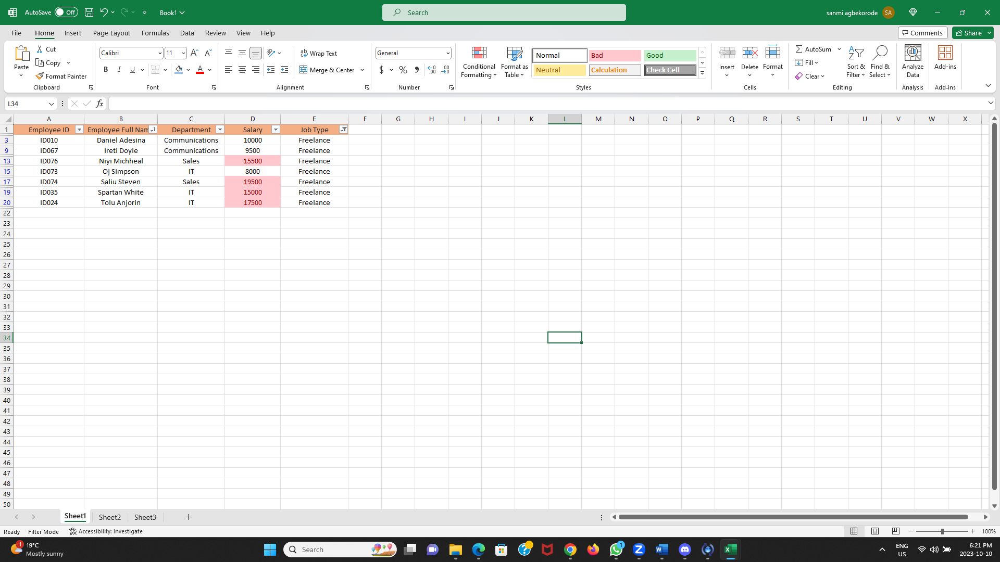
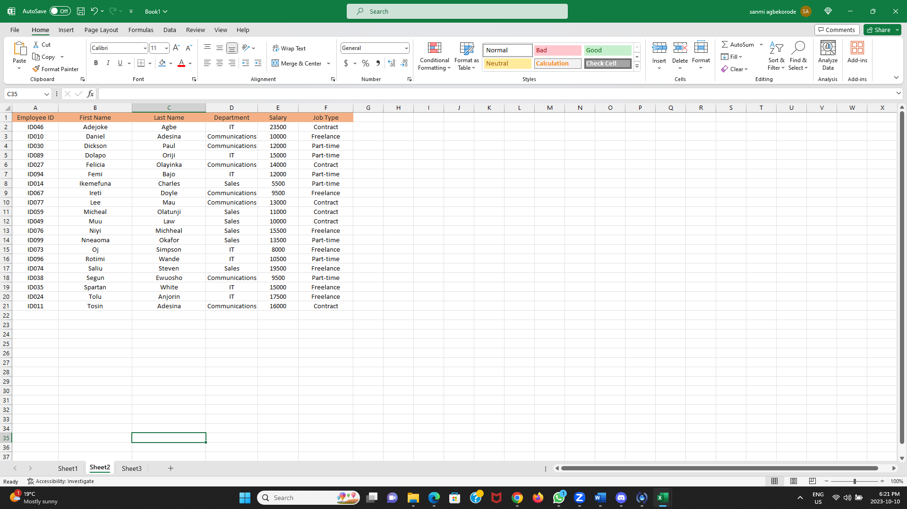
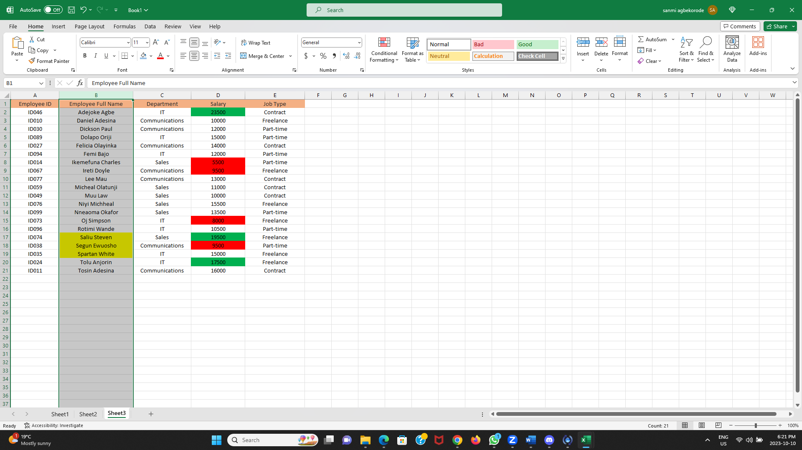
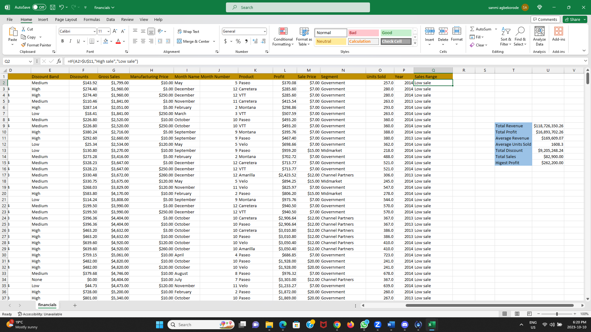

# Sanmi-s-Excel
A few excel files that I practiced on.

The first image is to show only employees who are freelancers with the ones who's salaries are above $10,000 highiglighted.

The second Image shows the names of the employees split into first name and last name. There were no duplictates.

The third image highlights employees whos's names begin with the letter 'S' with the top 3 salary earners highlighted in green and bottom 3 highlighted in red.

The fourth image is that of a sales data showing 
1. The total revenue and total profit generated.
2. The average revenue and average units sold.
3. The total discounts given in $.
4. The total numver of sales recorded.
5. The highest profit generated.

